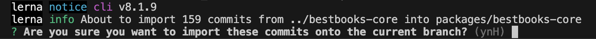
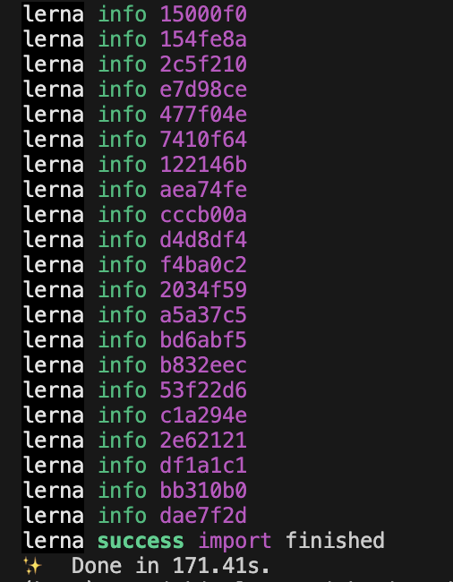

# Monolithic Repository (MONOREPO)
A **monorepo** (short for "monolithic repository") is a version-controlled code repository that houses multiple projects, often related or interconnected, in a single repository. This approach allows teams to manage, build, and version their projects collectively rather than separating them into individual repositories. 

### Key Characteristics of a Monorepo
1. **Single Repository**: All projects, libraries, and dependencies are stored in one repository.
2. **Shared Dependencies**: Common code or libraries can be reused across projects without duplication.
3. **Unified Version Control**: A single version history tracks changes across all projects.
4. **Cross-Team Collaboration**: Teams can work on interconnected projects seamlessly, as everything resides in the same place.

### Benefits
- **Code Reusability**: Shared libraries or modules can be updated and utilized across projects effortlessly.
- **Simplified Dependency Management**: Developers avoid duplication and maintain consistency across projects.
- **Streamlined CI/CD**: Centralized builds and deployments reduce fragmentation.
- **Improved Code Discovery**: Easier to find, navigate, and analyze code relationships and dependencies.

### Drawbacks
- **Scalability Concerns**: Large monorepos can become unwieldy and require specialized tooling.
- **Tooling Complexity**: May need tools for dependency graph management, incremental builds, and efficient version control operations.
- **Access Control Challenges**: Restricting access to specific projects within the monorepo can be tricky.

### Examples of Monorepo Users
Many large organizations use monorepos effectively, such as:
- **Google**: Hosts nearly all its projects in a single monorepo.
- **Facebook**: Uses a monorepo for most of its codebase.
- **Microsoft**: Combines many products and tools in a shared repository.

### Tools Supporting Monorepos
To manage monorepos, developers often use specialized tools:
- **Bazel**
- **Nx (for JavaScript/TypeScript projects)**
- **Lerna**
- **Rush**

Monorepos are ideal for tightly-coupled projects but may not suit every situation, particularly when projects are highly independent.

## Steps for reating a MONOREPO

1. Create your GIT repository
2. Clone your empty GIT repository
3. Change to the directory of your GIT repository
4. Issue the command, **npx lerna init**
5. Delete package-lock.json
6. Issue the command, **yarn**

### Import existing reposiotry

1. git clone <repository_url> /<repository_name>, e.g. git clone git@github.com:pingleware/bestbooks.git ../
2. yarn lerna import <path_of_repository>, e.g. yarn lerna import ../bestbooks-core

What’s great about Lerna is that it brings in all of the git commits along with it, such that for the new repo, the history looks like development has always been happening in this monorepo. This is crucial because you are going to need the git history when someone discovers a bug after moving to the monorepo.

3. git push, to commit changes to the reposiotry
