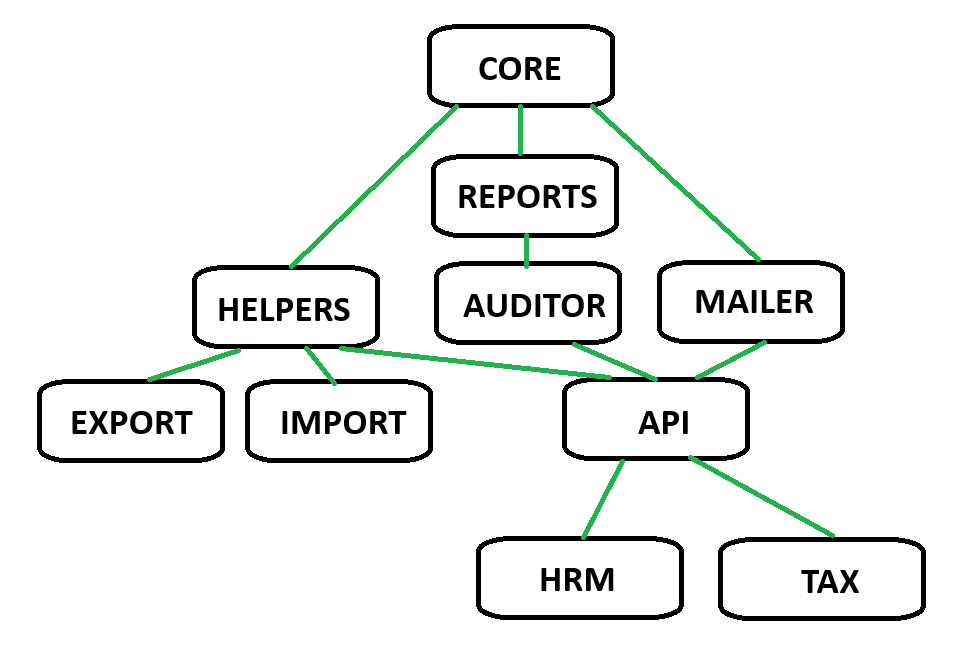

# BestBooks Accounting Application Framework&trade;
Monolithic repository (monorepo) for BestBooks Accounting Application Framework&trade;

BestBooks is an open source accounting application framework based on accounting terminology. Originally developed in Java to support multiple database because at the time the accounting applications had a close data model. Then migrated to PHP and as a WordPress plugin. BestBooks grew and matured as a WordPress plugin and became to cumbersome for a multiple site bookkeeping record system. A decision to rearchitect the framework with minimal web functionality interacting with a backend desktop-server component that can be placed behind a firewall.

NodeJS was chosen for the code base of the architecture because of one-code-base multiple platforms, as well as to breakup the functionality into node modules for easier maintenance with the base module beginning as the core.

The core module is a migration of the PHP classes from the WordPress plugin.

## Package list
| Module | Description                                                                   | Version |
|--------|------------------------------------------------------------------------------ | ------- |
| [core](packages/bestbooks-core)   | The core which provides database connectivity and logging |  1.3.4  |
| [auditor](packages/bestbooks-auditor)  | algorithmic auditing |  1.1.0  |
| [helpers](packages/bestbooks-helpers) | common methods used in accounting |  1.1.19 |
| [api](packages/bestbooks-api) | an API server interface |  1.4.0  |
| [receipts](packages/bestbooks-receipts) | Cordova application for receipt handling | 1.0.0 |
| [reports](packages/bestbooks-reports) | an XML based report generation without any third-party reporting frameworks |  1.2.5  |
| [export](packages/bestbooks-export) | permit exporting the records to other formats |  1.0.6  |
| [import](packages/bestbooks-import)  | permit importing financial information from other formats |  1.0.7  |
| [mailer](packages/bestbooks-mailer)  | a built SMTP mail server |  1.1.2  |
| [hrm](packages/bestbooks-hrm)     | a human resource management integration |  1.0.0  |
| [tax](packages/bestbooks-tax)     | tax integration for federal, state and local taxes |  1.0.0  |
| [ui](packages/bestbooks-ui)      | user application | 1.0.0 |

## Official User Guide
Avalable on [amazon](https://www.amazon.com/dp/B07H1GQZYC)

## How to use
The BestBooks Accounting Application Framework&trade; is a framework that can be integrated into other NodeJS applications to provide a seamless accounting and bookkeeping experience. Since the framework uses a shared database, multiple applications using this framework can update the same database, eliminating double posting. See the [Official User Guide](https://www.amazon.com/dp/B07H1GQZYC) for more information.

# Reporting
The reports module returns the report data in object-row format generate by SQL views.

## Income Statement
There are two income statement reports, a regular and a geographic income statement. The Geographic
income statement shows the percentage of total revenu by location as defined in the location table. Here is a sample view,

## Balance Sheet

## Accounts Receivable Aging

## Accounts Payable Aging

## Statement of Change in Equity

## Trial Balance

