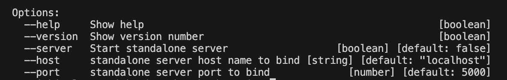

# BestBooks Accounting Application Framework - API Module

The API module for interfacing with the BestBooks Accounting Application Framework - HELPERS which also imports the CORE module

The **bestbooks.db** sqlite database file is located in the system directory of **.bestbooks** under the current user home directory.

You may import this module into another project or invoke the stndalone server option using the following arguments,

| ARGUMNET | VALUE  | DESCRIPTION                                                                                   |
| -------- | ------ | --------------------------------------------------------------------------------------------- |
| server   | false  | set to true to bypass module.exports and start the server in standalone mode, defaults: false |
| host     | string | the host name or IP address, defaults: localhost. Ignored when server=false                   |
| port     | number | a unused port number, defaults: 5000. Ignored when server=false                              |

The benefit of a standalone API server, will permit a client to reside anywhere on the same network without duplicating accounting entries, By using VPN with VLAN subnetting and a layer 3 switch, you can protect your accounting data from unauthroized access.



# JSON-RPC Server

Using the endpoint of **/,** you will make json-rpc requests. This permits one API route to handle multiple requests

## JSON-RPC Methods


| METHOD | ARGUMENTS | DESCRIPTION                                                         |
| :-----: | :-------: | ------------------------------------------------------------------- |
|  total  |     -     | obtains the total count of JSON-RPC methods, current;y at 96.       |
|  list  |     -     | obtains a sorted list of all JSON-RPC methods with the total count. |
| version |     -     | retrieves the pckage.json version number                            |

The current list of methods is,

```
	    "account_types",
            "accountsReceivablePayment",
            "accruedExpense",
            "accruedIncome",
            "accruedIncomePayment",
            "accruedInterest",
            "add",
            "addCredit",
            "addDebit",
            "addFundsToPostageDebitAccount",
            "addJournalTransaction",
            "addTransaction",
            "allocateFundingAccount",
            "asset",
            "badDebt",
            "balance",
            "bankfee",
            "bondDiscount",
            "bondPremium",
            "bondPremiumInterestPayment",
            "bondsIssuedWOAccruedInterest",
            "bondsIssuedWithAccruedInteres",
            "cardPayment",
            "cashDividendDeclared",
            "cashDividendPayable",
            "cashPayment",
            "chartofaccounts",
            "cogs",
            "commissionPaid",
            "commissionPayable",
            "createAccount",
            "createNewUser",
            "credit",
            "customer_estimate",
            "customer_invoice",
            "debit",
            "deferredExpense",
            "deferredRevenue",
            "distribution",
            "dividendDeclared",
            "dividendPaid",
            "editJournalTransaction",
            "editTransaction",
            "encumber",
            "equity",
            "exchangeCryptocurrencyToUSD",
            "exchangeUSDToCryptocurrency",
            "expense",
            "getTransactions",
            "getUsersByType",
            "googleAdsenseEarning",
            "googleAdsensePayout",
            "googleAdsenseReceivePayout",
            "headers",
            "initializeEquity",
            "interestExpense",
            "inventoryFinishedGoods",
            "inventoryPurchase",
            "inventoryRawMaterials",
            "inventoryShrinkage",
            "inventoryShrinkageReserve",
            "inventorySold",
            "inventoryWIP",
            "investment",
            "isJournalInbalance",
            "liability",
            "list",
            "loanPayment",
            "paidInCapitalStock",
            "payAssetsByCheck",
            "payAssetsByCredit",
            "payExpenseByCard",
            "payExpenseByCheck",
            "payrollPayable",
            "postageExpense",
            "prepaidSubscriptions",
            "recognizeDeferredExpense",
            "recognizeDeferredRevenue",
            "recognizePrepaidSubscription",
            "revenue",
            "salesCard",
            "salesCash",
            "salesViaPaypal",
            "securityDepositPaid",
            "securityDepositReceived",
            "softwareLicense",
            "spendFundingAccount",
            "stockDividend",
            "stocksIssuedOtherThanCash",
            "subtract",
            "total",
            "unearnedRevenue",
            "vendor_new_purchase",
            "vendor_update_purchase",
            "version",
            "workingHours"
```

# Exported Functions

The following functions are available when the **--server** option is **false**.

| FUNCTION     | ARGUMENTS | DESCRIPTION               |
| ------------ | :-------: | ------------------------- |
| start_server | host,port | start the JSON-RPC server |
| stop_server  |     -     | stops the JSON-RPC server |

# End of Life Doctrine

When a piece of software is useful there should never be an end-of-life doctrine. The goal of this software is to achieve immortality ;). When this software has reached that stage, this project may appear abandon but the opposit is true. This software has achieve that state where maintenance is no longer required.

Patrick O. Ingle
